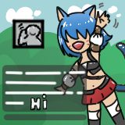
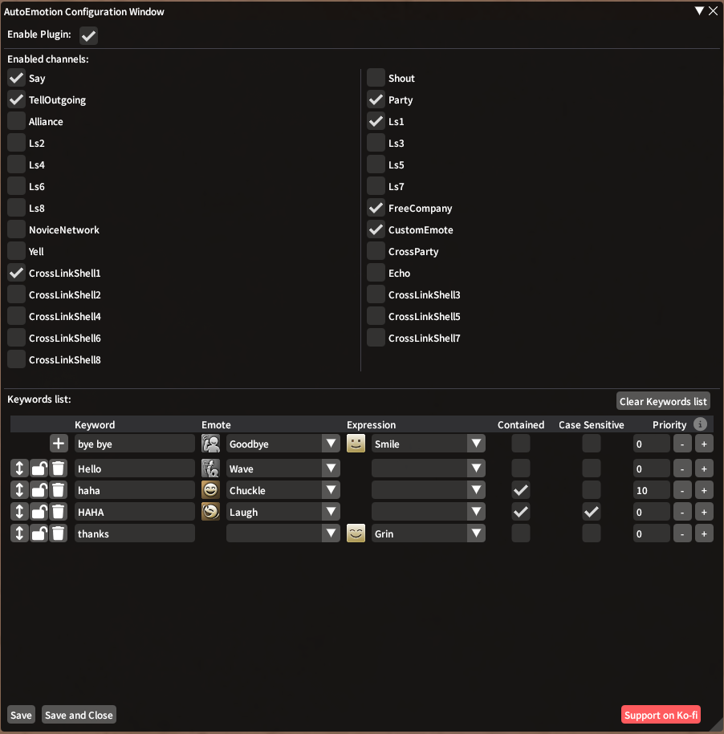

# AutoEmotion

 

Ever wished your game could automatically use emotes and expressions based on the specific keywords or phrases you type in chat?

With **AutoEmotion**, your wish is granted! This plugin allows you to set up custom triggers for specific phrases or keywords, automatically activating emotes and expressions directly in-game. 

Customizable triggers and combinations to fit your specific style and expression!
 

## Main Points

* Features
  * Slash commands to quickly turn the plugin on or off
  * Settings UI
  * Search for any emote or expression quickly
  * Priorities for emotes
  * Activate only in specific channels
  * Case-sensitive check for trigger
  * Check if the trigger is contained in the message or if it's a whole word
  * Organize and reorder the trigger list

 

 

## How To Use

### Installation

You can install AutoEmotion by adding the custom repository:

1. Open Dalamud's Settings by typing `/xlsettings` in chat 
2. Go to the *Experimental* tab
3. Under *Custom Plugin Repositories* section, add the following Dalamud repo:

`https://raw.githubusercontent.com/FoxShadow10/AutoEmotion/main/repo.json`

4. Save and close
5. Install the plugin **AutoEmotion** as you would with any other plugin

### Usage

You can open the configuration for AutoEmotion by either opening the plugin from the *cog* button in Dalamud or by typing `/aemote`.

You can then quickly toggle on and off the plugin by typing `/aet` (**A**uto **E**motion **T**oggle)

All the configuration is done through the configuration window.

## Credits

Plugin icon made by **AlcielCroix** @ https://x.com/AlcielCroix

If you like the plugin and want to support me you can donate through Ko-Fi @ https://ko-fi.com/foxshadow10

This is my first plugin (and first experience with C#), so thanks to all of the developers that have helped me make this.

Special thanks to the projects that make this plugin work:

* [Dalamud](https://github.com/goatcorp/Dalamud/)
* [ECommons](https://github.com/NightmareXIV/ECommons)
* [SimpleHeels](https://github.com/Caraxi/SimpleHeels)
* [ChatBubbles](https://github.com/Haplo064/ChatBubbles)
* [Moodles](https://github.com/kawaii/Moodles)

## ⚠️Disclaimer⚠️
This is not an official Dalamud plugin and contains automatisms.

Normally nothing should happen, but use it at your own risk.
